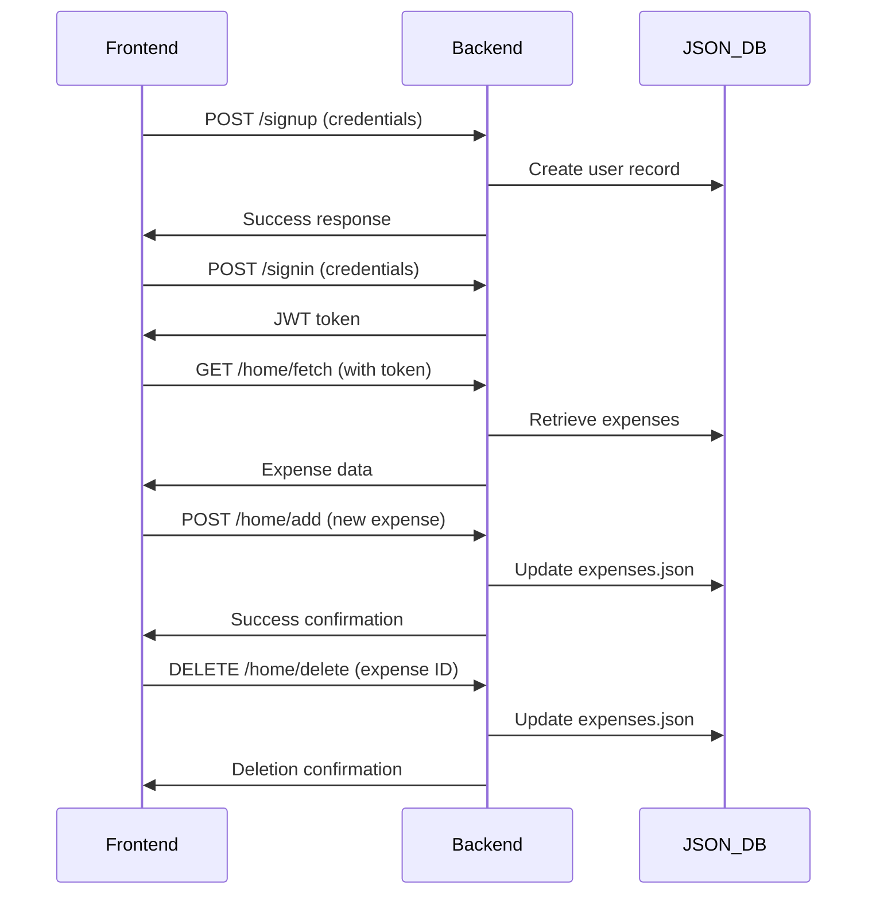

# Expensify - Expense Tracker Web Application

  
*Track your expenses, visualize spending patterns, and manage your finances with ease.*

---

## 1. Project Title and Tagline
**Expensify** — A lightweight expense tracker to log spending, visualize distribution with pie charts, and keep your finances organized.

---

## 2. Introduction
Expensify is a simple full‑stack expense tracking application built with Node.js/Express on the backend and plain HTML/CSS/JavaScript on the frontend. It supports user authentication, expense CRUD (add, view, delete), and visualizes spending using Google Charts. Data is stored in JSON files for a minimal, easy-to-inspect database.

---

## 3. Features
- 🔐 JWT-based authentication (signup, login)
- 💰 Add and delete expenses (name, amount, category)
- 📊 Pie chart visualization (Google Charts) for expense distribution
- 📁 JSON file-based storage (`users.json`, `expenses.json`)
- 🔄 Real-time UI updates after adding or deleting expenses
- 📱 Responsive, mobile-friendly frontend

---

## 4. Technologies Used
**Backend:** Node.js, Express, jsonwebtoken, cors, Axios (server-server calls), `fs` for file IO  
**Frontend:** HTML, CSS, Vanilla JavaScript, Axios, Google Charts API

---

## 5. Project Structure (File Overview)
```
expensify/
├── backend/
│   ├── server.js        # Main server (auth routes)
│   ├── expenses.js      # Expense route handlers
│   ├── utils.js         # File operations & helpers
│   ├── users.json       # User credentials storage
│   └── expenses.json    # Expenses storage
├── frontend/
│   ├── index.html       # Landing / auth links
│   ├── signin.html      # Login page
│   ├── signup.html      # Registration page
│   ├── home.html        # Dashboard (add/view/delete + chart)
│   ├── index.css
│   └── home.css
└── README.md

```

---

## 6. Setup and Installation

### Prerequisites
- Node.js v18+ (recommended)
- npm (comes with Node.js)

### Install & run   
```bash
# clone the repo
git clone https://github.com/Kunal-Rathore/Expensify_Project-2.git
cd  Expensify_Project-2/  # or the project root depending on layout

# install dependencies
npm install express jsonwebtoken axios cors

# start the server
node server.js
```

> By default the backend listens on `http://localhost:3000`. Serve the frontend files (open `frontend/index.html`) in the browser or configure Express to serve static files from `frontend/` to avoid `file://` CORS problems.

---

## 7. Usage

1. Open the app in your browser (or visit the served URL).  
2. Sign up with an email/username and password.  
3. Log in — on success the server returns a JWT token (stored client-side).  
4. On the dashboard (`home.html`) you can:
   - Add an expense (name, amount, optional category)
   - See your expenses listed and aggregated on a pie chart
   - Delete an expense with the delete action
5. The frontend includes logic to call the backend endpoints and redraw the chart after any change.

---

## 8. API Reference

### Authentication Routes
| Endpoint | Method | Description |
|---|---:|---|
| `/signup` | POST | Create a new account. Body: `{ username, password }` |
| `/signin` | POST | Login and receive a JWT token in response header `token` |
| `/isValid` | POST | Validate a JWT token (used for protected routes) |

### Expense Routes (`/home`)
| Endpoint | Method | Description |
|---|---:|---|
| `/home/fetch` | GET | Returns the logged-in user's expenses — requires token in headers |
| `/home/add` | POST | Add a new expense. Body: `{ expense_name, expense_cost, CategoryOfExpense }` |
| `/home/delete` | DELETE | Delete an expense by ID. Body: `{ parseId }` |

**Notes:**
- The server verifies JWT tokens for protected routes. Tokens are typically sent in a `token` header.
- The backend reads/writes the `expenses.json` file on each write operation. This is simple but not optimized for concurrent writes — consider a DB for production.

---

## 9. Future Improvements
- Use a proper database (SQLite / MongoDB / Postgres) for reliability and concurrency.
- Hash passwords (bcrypt) and store salted hashes (if not already implemented).
- Add expense editing and date tracking (timestamps) for history and trends.
- Add filtering and time-range charts (weekly/monthly/yearly).
- Add forgot-password flow.
---

## 10. Acknowledgements
- Built as a learning/full-stack practice project.  
- Uses Google Charts for visualization and demonstrates a token-based auth flow.  
- Inspired by the everyday need to track small purchases and recurring subscriptions.

---

## System Workflow Diagram



---

## Installation
1. Clone the repo  
```bash
git clone https://github.com/Kunal-Rathore/Expensify_Project-2.git
cd Expensify_Project-2
```

2. Install dependencies  
```bash
npm install
```

3. Run the backend server  
```bash
node backend/server/server.js
```

4. Open `frontend/index.html` in your browser.

## License
This project is licensed under the MIT License.

---

> "Building this taught me more about real-world coding than any tutorial. Every bug fixed was a lightbulb moment!"  
> – You, probably 😄

**Happy budgeting! ✨**   